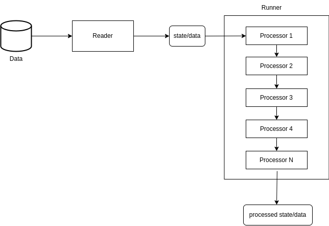

**************************
What is Pipeliner?
**************************

Any data processing operation consists of 3 main steps: 1- read the data. 2- defining processing operations. 3 running the processing operations.

and that is what pipeliner tries to achieve, an organized and a safe structure to process data and it achieves the previous 3 steps via the 3 main components that it depends on a Reader, Processors and a Runner.

the entire flow is demonstrated on the following chart:

######
Reader
######

A reader is responsible of initializing and loading the data needed to be processed, and basically 2 reading methods are supported:

#. Bulk Readers: which handles reading bulk data  all at once,
#. Stream Readers: which handles reading data from a stream source, like a network or a very large file,

right now pipeliner provides:

* File Reader.
* CSV Reader.
* And Base classes that should be inherited from when implementing custom reading in order to work cohesively with the appropriate Runner.

and you are encouraged check the :doc:`API Reference <./api>` for more information on what pipeliner provides.

#########
Processor
#########

A processor is a single units that is responsible for processing the data at certain state and return the processed
data to be the new state to be processed by another processor.

Processors trys to stay decoupled from each other (unless the processing operation is step based and one step failing
could affect the result) but trys to stay cohesive with each other when running it all together, that is achieved with help of Runners.

Also a processor can be used easily on its own without the existence of a Runner either as a block of code or for testing purposes.

######
Runner
######

A runner is responsible for receiving data from a Reader and then passing that data to be processed using the Processors.

A runner runs processors based on what's needed, for example if data is coming from a stream, then the runner will have to
accept data from a stream and pass these to the processors and return the result, and then waits for the next batch and
redo the previous steps (BaseStreamRunner is provided by pipeliner),
or it might just wants to run the processors in a multiprocessing manner (coming soon).
